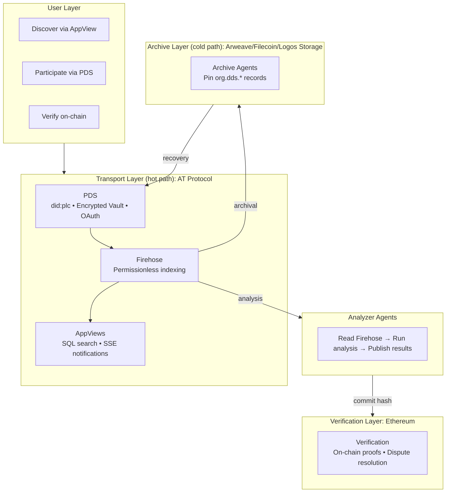
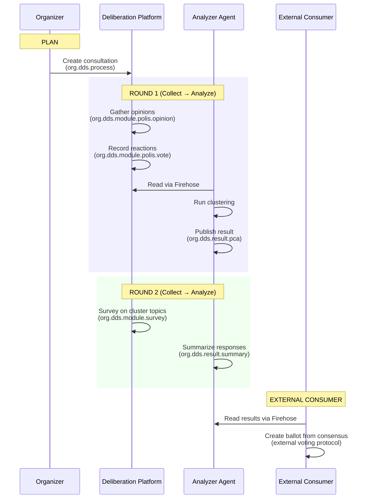

| Metadata    | Value                                                                                                                                                                                                           |
| :---------- | :-------------------------------------------------------------------------------------------------------------------------------------------------------------------------------------------------------------- |
| **Title**   | DDS: Verifiable Deliberation on AT Protocol                                                                                                                                                                     |
| **Status**  | Working Draft                                                                                                                                                                                                   |
| **Created** | 2026-01-13                                                                                                                                                                                                      |
| **Author**  | Nicolas Gimenez (ZKorum, Agora Citizen Network) |
| **Related** | [Design Rationale](./design-rationale.md), [Anonymity Addendum](./anonymity-addendum.md), [Implementation Addendum](./implementation-addendum.md) |

## 1. Introduction

The **Decentralized Deliberation Standard (DDS)** is an open protocol for sovereign, verifiable, interoperable, and resilient deliberation. The protocol leverages **AT Protocol** for transport, **Arweave/Filecoin/Logos Storage** for archival, and **Ethereum** for verification.

DDS is organized around four design tensions:

| Tension                                | Description                                                         |
| -------------------------------------- | ------------------------------------------------------------------- |
| **Ownership vs Convenience**           | Real sovereignty with a familiar login experience                   |
| **Discoverability vs Durability**      | The UX of federation with the durability guarantees of P2P          |
| **Provable vs Economical Computation** | Auditable analysis without requiring every user to run their own    |
| **Autonomy vs Interoperability**       | Standardized building blocks that compose permissionlessly          |

See the [Design Rationale](./design-rationale.md) for expanded discussion of each tension and the reasoning behind protocol choices.

When in doubt, DDS optimizes for **usability without sacrificing walkaway capability**: the guarantee that if all providers vanish, users retain sovereign control of their cryptographic identity and can recover their data from decentralized archives.

> **Note**: DDS distinguishes between **participant anonymity** (hiding _who_ said what) and **deliberation access** (restricting _who_ can see and participate). These are orthogonal concerns. See [§9](#9-deliberation-access) for access control and the [Anonymity Addendum](./anonymity-addendum.md) for participant anonymity.

## 2. Terminology

### Key Definitions

| Term              | Definition                                                                                                |
| ----------------- | --------------------------------------------------------------------------------------------------------- |
| **PDS**           | Personal Data Server. Hosts a user's AT Protocol repository and manages their signing key.                |
| **DID**           | Decentralized Identifier. A portable, self-sovereign identity (`did:plc` for persistent, `did:key` for ephemeral). |
| **Firehose**      | AT Protocol's real-time stream of all repository commits across the network.                              |
| **AppView**       | A service that indexes Firehose data and provides query APIs for applications.                            |
| **Lexicon**       | AT Protocol's schema system. Machine-readable, PDS-enforced data type definitions.                       |
| **Analyzer Agent**| A service that reads Firehose data, runs analysis (clustering, summarization), and publishes results.     |
| **Archive Agent** | A service that listens to the Firehose and pins `org.dds.*` records to decentralized storage.            |
| **Organizer**     | The entity that creates and configures a deliberation process.                                            |
| **Deliberation**  | A structured process of collective input and analysis, organized as Plan, Collect, and Analyze phases.    |

### Participant Identity Levels

These levels describe what other participants see about a user. They are independent of metadata privacy (what infrastructure operators can infer). See the [Anonymity Addendum](./anonymity-addendum.md) for detailed threat models and implementation guidance for each level.

| Level | Name                      | Description                                                                                                  |
| ----- | ------------------------- | ------------------------------------------------------------------------------------------------------------ |
| **0** | Identified                | Credentials attached to DID reveal real-world identity. Fully linkable across deliberations.                 |
| **1** | Pseudonymous (default)    | DID not linked to real name. Same DID across deliberations (linkable by DID). Protects against casual deanonymization. |
| **2** | Anonymous (persistent)    | Persistent DID with ZK nullifier. No strong identifiers attached. Linkable by DID but no credential-based deanonymization path. In practice, closer to pseudonymity with credential hiding than true anonymity. |
| **3** | Anonymous (per-deliberation) | Fresh ephemeral identifier per deliberation (DID method TBD). Unlinkable across deliberations. ZK nullifiers scoped per context. |

### Hosting Tiers

| Tier  | Name        | Description                                                                                                                                     |
| ----- | ----------- | ----------------------------------------------------------------------------------------------------------------------------------------------- |
| **2** | Self-Hosted | User brings their own PDS. Direct authentication.                                                                                               |
| **1** | Managed     | User authenticates via any accepted credential. Application auto-provisions a PDS account.                                                      |
| **0** | Guest       | Guest user. Identity may be managed `did:plc` (persistent pseudonymous participation) or `did:key` (per-deliberation anonymity, external data). |

See the [Implementation Addendum, PDS Hosting & Authentication](./implementation-addendum.md#2-pds-hosting--authentication) for details and the [Implementation Addendum, Guest Identity and Account Upgrade](./implementation-addendum.md#5-guest-identity-and-account-upgrade) for the Tier 0 design exploration.

## 3. Architecture Overview

DDS uses a hybrid three-layer architecture. Each layer uses the protocol best suited to its role, so no single system needs to do everything. The layers are independent: losing one does not compromise the others.



- **Transport Layer (hot path)**: AT Protocol handles discovery, search, and real-time interaction. PDSes host data, the Firehose enables permissionless indexing, and AppViews provide query APIs.
- **Archive Layer (cold path)**: Arweave, Filecoin, and Logos Storage provide permanent archival and walkaway recovery.
- **Verification Layer**: Ethereum anchors result hashes for tamper-evidence, and future verification proofs for computation correctness.

See the [Design Rationale, Protocol Selection](./design-rationale.md#2-protocol-selection-why-at-protocol) for the reasoning behind this architecture.

## 4. Identity and Authentication

### 4.1 Flexible Authentication

DDS defines a shared authentication interface, not a fixed set of identity methods. Any app can accept any credential type: the protocol standardizes how credentials are represented and shared across tools, not which credentials are valid.

The spectrum ranges from simple auth to cryptographic proofs:

- **Simple authentication**: Email, phone, social login. A way to connect to the PDS. No cryptographic binding to a real-world attribute.
- **Cryptographic proofs**: ZK passport, ZKPass, Zupass event tickets, W3C Verifiable Credentials, eIDAS eWallets, wallet signatures. Two-way binding with verifiable properties (e.g., "is a citizen," "holds an event ticket," "is over 18").

Apps choose which credential types to accept for each deliberation. Users range from self-hosted (own PDS) to lightweight guests (ephemeral `did:key`). Every participant has a DID and can attach credentials from any accepted method.

### 4.2 Participant Identity Levels

The four identity levels defined in [§2](#2-terminology) describe what other participants see about a user:

- **Level 0 (Identified)**: Real-world identity visible. Maximum accountability.
- **Level 1 (Pseudonymous)**: DDS default. DID not linked to real name. Linkable across deliberations by DID.
- **Level 2 (Anonymous, persistent)**: Persistent DID with ZK nullifier, no strong identifiers attached. Proves eligibility without revealing identity. Linkable by DID (see [Anonymity Addendum, Level 2 caveat](./anonymity-addendum.md#level-2-anonymous-participation-persistent) for limitations).
- **Level 3 (Anonymous, per-deliberation)**: Ephemeral identifier per deliberation. Unlinkable across contexts. ZK nullifiers scoped per deliberation. DID method TBD. Requires re-verification per deliberation.

The [Anonymity Addendum](./anonymity-addendum.md) provides correlation vector analysis, threat models, and the recommendation of two distinct implementation paths (pseudonymity vs. strong anonymity).

### 4.3 Shared Organizations

Organizations, including teams, DAOs, communities, and coalitions, are defined at the protocol level via base lexicons (`org.dds.org.*`). Membership, roles, and permissions are readable by any tool on the Firehose. An org created in one app is visible to every other app, with no bilateral integration needed.

This enables cross-tool workflows: a community platform manages membership, a deliberation tool checks eligibility, a voting app enforces access rights, all reading the same org records.

### 4.4 The Encrypted Key Vault (Optional)

AT Protocol's `did:plc` already enables walkaway: users who control their Rotation Key can migrate to any PDS or self-host. The simplest path is to back up the Rotation Key manually (paper, password manager) or choose a hosting provider you trust.

The **Encrypted Key Vault** is an optional enhancement that removes the burden of manual key backup: the user's Rotation Key is encrypted and stored in their Repository. Since Repositories are archived to decentralized storage ([§5.2](#52-network-archival)), the vault is recoverable even if the PDS vanishes. Two vault designs are proposed, one wallet-derived and one device-based. See the [Implementation Addendum, Encrypted Key Vault](./implementation-addendum.md#1-encrypted-key-vault-cryptographic-design-optional) for cryptographic details.

## 5. Data Transport and Durability

### 5.1 Hybrid Architecture

AT Protocol serves as the hot path (discovery, search, real-time interaction), Arweave/Filecoin/Logos Storage as the cold path (archival, walkaway recovery), and Ethereum as the commitment layer (result hashes for tamper-evidence, and future verification proofs for computation correctness). These three layers compose: AT Protocol stores live data, archival preserves it permanently, and Ethereum anchors verification (hash commitments today, zkML proofs as the technology matures).

### 5.2 Network Archival

- **Role**: Archive Agents listen to the Firehose for `org.dds.*` commits.
- **Action**: Pin Repository updates to Arweave/Filecoin/Logos Storage.
- **Keys in Repo**: If the optional Encrypted Key Vault is used, `org.dds.key.wrapped` is in the Repository and automatically archived.
- **Result**: Even if the provider vanishes, User's Identity (PLC Directory) and data are recoverable from decentralized archives. If the vault is used, the Rotation Key is also recoverable.

### 5.3 Local Resilience

- **Cache**: Client mirrors the Encrypted Vault Blob to `IndexedDB`.
- **Export**: Users can perform "On-Demand Export" (decrypt in memory) to download CAR file + unlocked keys.

## 6. Analyzer Protocol

> **Note**: The Analyzer Protocol and trust levels below are conceptual. The on-chain verification layer requires significant research into feasibility, gas costs, and proof system selection. This tension is protocol-agnostic: verifiable computation works regardless of the underlying transport layer.

### 6.1 The Cost Problem

Running analysis, including clustering (PCA, Reddwarf), LLM sensemaking, and other methods, requires data access (reading all participant input from the Firehose), compute (running analysis algorithms), and infrastructure (maintaining servers to process deliberations). For a single user to verify results independently, they'd need to replicate this entire pipeline. This is impractical at scale.

### 6.2 Agent Protocol

DDS solves this by separating **computation** from **verification**:

1. **Input**: Agent defines a "Scope" (Deliberation ID + Time Window).
2. **Process**: Agent reads all Repositories from the Firehose matching the Scope.
3. **Compute**: Runs analysis (e.g., Reddwarf clustering, LLM summarization).
4. **Output**: Publishes result (e.g., `org.dds.result.pca`, `org.dds.result.summary`).

Because inputs (data on the Firehose) and algorithm (open-source) are public, **anyone can re-run the computation to verify an Analyzer's results**. This makes the system auditable without requiring every user to run their own analyzer.

### 6.3 Trust Levels

| Level          | Mechanism                                                                           | Cost                     | Guarantee                                                                                                                                  |
| -------------- | ----------------------------------------------------------------------------------- | ------------------------ | ------------------------------------------------------------------------------------------------------------------------------------------ |
| **Reputation** | Analyzer publishes results to Firehose                                               | Free for users           | Trust the Analyzer's reputation                                                                                                            |
| **Spot check** | Any party re-runs computation independently                                         | Moderate (compute costs) | Deterministic verification                                                                                                                 |
| **Trustless**  | Analyzer submits proof on-chain; clients verify cheaply (e.g., ZK proof verification) | Gas fees               | Cryptographic proof: no trust required (see [Implementation Addendum, Fraud Proving Mechanism](./implementation-addendum.md#41-fraud-proving-mechanism-zkml)) |

See the [Design Rationale, zkML](./design-rationale.md#31-zkml-the-trustless-level) for the Trustless level and the [Design Rationale, Vocdoni / DAVINCI Comparison](./design-rationale.md#32-vocdoni--davinci-comparison) for verification layer context.

### 6.4 Result Commitment

> **Note**: The result commitment protocol below is a first proposal. Smart contract design, chain selection (L1 vs L2), and gas optimization need further specification.

The trust levels above address **computation correctness**: is the Analyzer's output honest? A separate concern is **result permanence**: can an Analyzer silently modify or retract published results after the fact?

DDS addresses this with **on-chain result commitment**: when a consultation finishes, a cryptographic hash of the result is committed to Ethereum (or an L2). This makes results tamper-evident and permanently anchored, independent of any single operator. The commitment can be made by the Analyzer, the Organizer, or any other party. The protocol defines the commitment format, not who commits.

**What gets committed:**

| Field            | Content                                                |
| ---------------- | ------------------------------------------------------ |
| Deliberation URI | AT Protocol reference to the deliberation process      |
| Scope            | Time window of the analysis                            |
| Input hash       | Merkle root of all input records in scope              |
| Algorithm        | Identifier + version (e.g., `reddwarf@2.1.0`, `summarizer@1.0.0`) |
| Output hash      | Hash of the published result record                    |
| Analyzer DID     | Identity of the computing agent                        |

**Verification**: Anyone downloads the inputs from the Firehose (public), re-runs the algorithm (open-source), and compares the result hash against the on-chain commitment. No ZK proofs required, just deterministic re-execution.

Result commitment **enhances Spot Check**: the on-chain hash makes tampering detectable without requiring re-computation upfront. The **Trustless** level (ZK proof of computation correctness without re-execution) remains future work, with some analysis types (vote tallying, clustering) already feasible.

See [Implementation Addendum, Result Commitment Protocol](./implementation-addendum.md#6-result-commitment-protocol) for protocol details and open questions.

## 7. Deliberation Lifecycle

DDS organizes deliberation as an iterative cycle of three phases, each potentially handled by different applications:

| Phase       | Purpose                                                                                                                    | Example Apps                                                 |
| ----------- | -------------------------------------------------------------------------------------------------------------------------- | ------------------------------------------------------------ |
| **Plan**    | Design the consultation: define rounds, modules, eligibility, transition rules, how analysis informs the next round         | Community platforms, grassroots organizers, governance tools, citizen assemblies, DAOs |
| **Collect** | Gather participant input (opinions, votes, comments) and import external data (social media APIs, other deliberation tools, AI-assisted conversation capture) | Deliberation platforms (wikisurveys, demographic surveys), data importers, AI-assisted listening tools |
| **Analyze** | Process data and derive insights: opinion mapping, topic clustering, summaries, consensus metrics, peer review              | Analyzer Agents, analysis dashboards                         |

The lifecycle is iterative: Plan defines a sequence of Collect then Analyze rounds. Analysis from one round can trigger the next: new questions, refined topics, deeper dives. The relationship between Collect and Analyze is many-to-many: multiple competing Analyzers can process the same collected data (different algorithms, different perspectives), and multiple Collect streams can feed a single analysis. All are loosely coupled via the Firehose.

What happens with the final results, whether a binding vote via an external voting protocol, a DAO proposal, or a published report, is outside DDS scope. DDS produces structured, verifiable outputs; execution systems consume them via the Firehose.

Applications specialize in one or more phases, but **interoperate via shared lexicons**. Any organizing app, whether a community platform, a DAO, or a grassroots coalition, can orchestrate a deliberation: plan with its own UI, collect via a deliberation platform, analyze via an Analyzer. External systems (voting protocols, DAOs, governance tools) can then consume the results.

The following example shows a two-round consultation, Polis-style clustering followed by a survey, with an external consumer picking up the results:



## 8. Lexicons and Interoperability

### 8.1 Layered Lexicons

DDS uses a layered lexicon design enabling permissionless interoperability:

```
┌────────────────────────────────────────────────────────┐
│                   PRODUCT LEXICONS                      │
│  (Domain-specific, owned by each app)                  │
│                                                        │
│  org.dds.module.polis  - Polis-style (opinions, votes) │
│  org.dds.module.sense  - LLM sensemaking               │
│  org.dds.module.survey - Surveys, questionnaires       │
│  org.dds.module.vote   - Voting (token, quadratic)     │
│  org.dds.result.pca    - Clustering analysis           │
│  org.dds.result.*      - Other analysis outputs        │
└────────────────────────────────────────────────────────┘
                          │
                          ▼
┌────────────────────────────────────────────────────────┐
│                    BASE LEXICONS                        │
│  (Shared primitives, used by all apps)                 │
│                                                        │
│  org.dds.identity.*   - DID profiles, verification     │
│  org.dds.auth.*       - Permissions, capabilities      │
│  org.dds.org.*        - Organizations, DAOs, groups    │
│  org.dds.ref.*        - Cross-app references           │
└────────────────────────────────────────────────────────┘
                          │
                          ▼
┌────────────────────────────────────────────────────────┐
│                  AT PROTOCOL BASE                       │
│  com.atproto.*, app.bsky.*                             │
└────────────────────────────────────────────────────────┘
```

**Base Lexicons** (shared by all apps):

- `org.dds.identity.*`: DID profiles, verification status
- `org.dds.auth.*`: Capabilities, permissions, delegation
- `org.dds.org.*`: Organizations, DAOs, membership
- `org.dds.ref.*`: Cross-app references (point to records in other namespaces)

**Product Lexicons** (owned by each app):

- `org.dds.module.polis`: Polis-style deliberation (opinions, agree/disagree votes)
- `org.dds.module.sense`: LLM-based sensemaking (Talk to the City, Jigsaw Sensemaker)
- `org.dds.module.survey`: Surveys, questionnaires, structured data collection
- `org.dds.module.vote`: Generic voting (token-weighted, quadratic, ranked-choice, etc.)
- `org.dds.result.pca`: Clustering analysis outputs
- `org.dds.result.summary`: LLM-generated summaries, sensemaking outputs

### 8.2 Modular Inputs

DDS supports any consultation type via pluggable modules. Each module defines its own record types:

**`org.dds.module.polis` (Polis-style opinion matrix)**:

- **Opinion**: `{ text: string }`
- **Vote**: `{ targetCid: string, value: -1|0|1 }`

Other product lexicons follow the same pattern: a sensemaking module, a survey module, or any future consultation format. Data from external sources, such as social media APIs, LLM-based listening platforms, and existing pol.is exports, is translated into the appropriate module's lexicons during the Collect phase (e.g., tweets become `org.dds.module.polis` opinions, conversation transcripts become `org.dds.module.sense` records). The exact mappings are TBD.

### 8.3 Cross-App Interoperability

Any app can **read** another app's product lexicons via the Firehose. The `org.dds.ref.*` lexicon enables explicit references:

```typescript
// A voting app references a deliberation platform's analysis
{
  "$type": "org.dds.module.vote.proposal",
  "title": "Fund Proposal Alpha",
  "context": {
    "$type": "org.dds.ref.analysis",
    "uri": "at://did:plc:abc.../org.dds.result.pca/xyz",
    "cid": "bafyrei..."
  },
  "options": [
    { "label": "Approve", "derivedFrom": "cluster-1-consensus" },
    { "label": "Reject", "derivedFrom": "cluster-2-consensus" }
  ]
}
```

**Common Patterns:**

| Pattern                 | Description                                         |
| ----------------------- | --------------------------------------------------- |
| **Sequential Handoff**  | Deliberation, then Analysis, then External consumer (voting, governance) |
| **Parallel Collection** | Multiple collection apps feed the same analysis     |
| **Context Import**      | New process imports conclusions from a previous one |

## 9. Deliberation Access

Deliberation access restricts who can participate in or view a deliberation. This is distinct from participant anonymity (see [Anonymity Addendum](./anonymity-addendum.md)). DDS defines two access modes:

### 9.1 Participation-Gated (Common)

The deliberation is publicly viewable, but only people with the share link can submit opinions and votes. The organizer generates a signing keypair; the private key is embedded in the URL fragment (never sent to the server), and participants sign their submissions with it. The AppView only accepts records with valid signatures.

### 9.2 Restricted (Rare)

The deliberation cannot be viewed by outsiders. All records are encrypted with a symmetric key embedded in the share link's URL fragment. The Firehose sees ciphertext only. Having the key means having access.

See the [Implementation Addendum, Deliberation Access](./implementation-addendum.md#7-deliberation-access) for mechanism details, link structure, and open questions.

## 10. Security Considerations

Security considerations for DDS span several areas:

- **MITM on device sync**: During key vault device sync, a malicious PDS could present its own key. Mitigated by QR code verification.
- **Public exposure of encrypted keys**: Encrypted key vaults are public on the Firehose. Mitigated by mandating high-entropy keys.
- **Lost rotation key**: Users who lose all devices and their recovery code lose walkaway capability (but retain PDS access).
- **Privacy trade-off**: Managed PDS hosts can access user data. Users requiring full data privacy should self-host.
- **Data availability attack**: A malicious PDS could accept vault data but not publish to the Firehose. Clients should verify archival independently.

See the [Implementation Addendum, Security Considerations](./implementation-addendum.md#3-security-considerations) for detailed analysis.

## 11. Open Questions

The following areas require further design work:

- **Guest identity and account upgrade**: How guests transition from ephemeral to persistent identity. See [Implementation Addendum, Guest Identity](./implementation-addendum.md#5-guest-identity-and-account-upgrade).
- **zkML feasibility**: Which analysis types can be cryptographically proved and on what timeline. See [Implementation Addendum, Fraud Proving Mechanism](./implementation-addendum.md#41-fraud-proving-mechanism-zkml).
- **Chain selection**: Ethereum L1 vs L2 for result commitments. See [Implementation Addendum, Result Commitment Open Questions](./implementation-addendum.md#65-open-questions).
- **Restricted deliberation encryption**: Key format, revocation strategy, analyzer key distribution. See [Implementation Addendum, Deliberation Access](./implementation-addendum.md#7-deliberation-access).
- **Lexicon formalization**: Concrete schema definitions for base and product lexicons.

## 12. References

- [AT Protocol Specification](https://atproto.com/)
- [Arweave](https://www.arweave.org/)
- [Filecoin](https://filecoin.io/)
- [Logos Storage](https://logos.co/)
- [Ethereum](https://ethereum.org/)
- [Vocdoni DAVINCI](https://vocdoni.io/)
- [EZKL](https://github.com/zkonduit/ezkl)
- [Design Rationale](./design-rationale.md)
- [Anonymity Addendum](./anonymity-addendum.md)
- [Implementation Addendum](./implementation-addendum.md)
