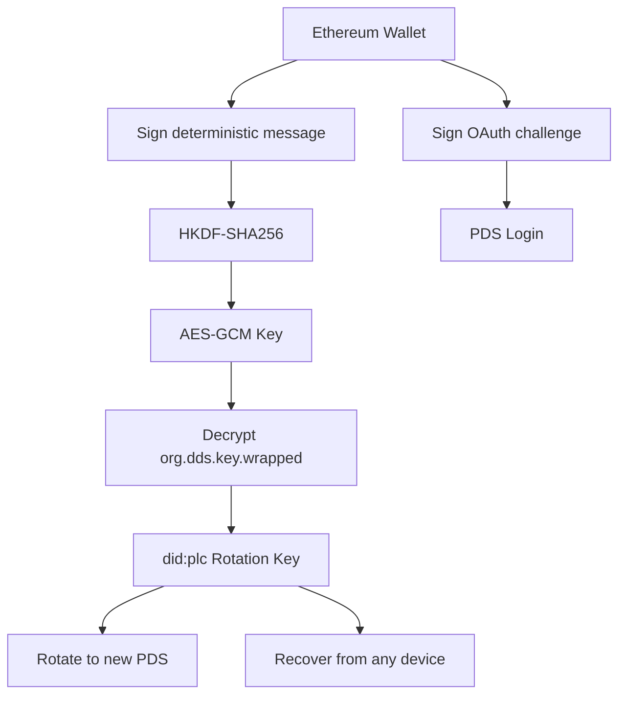
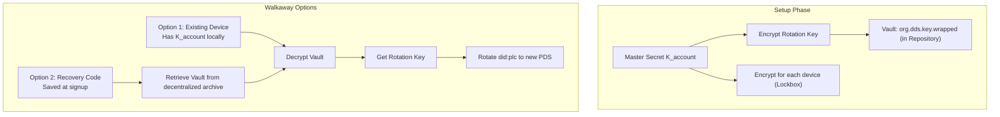
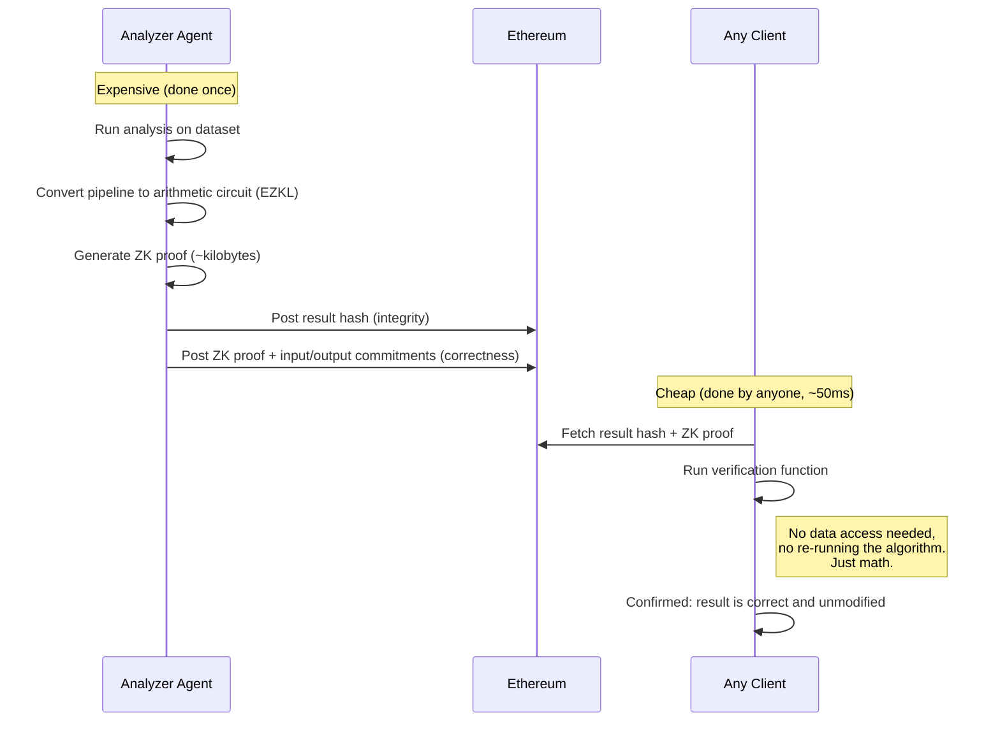
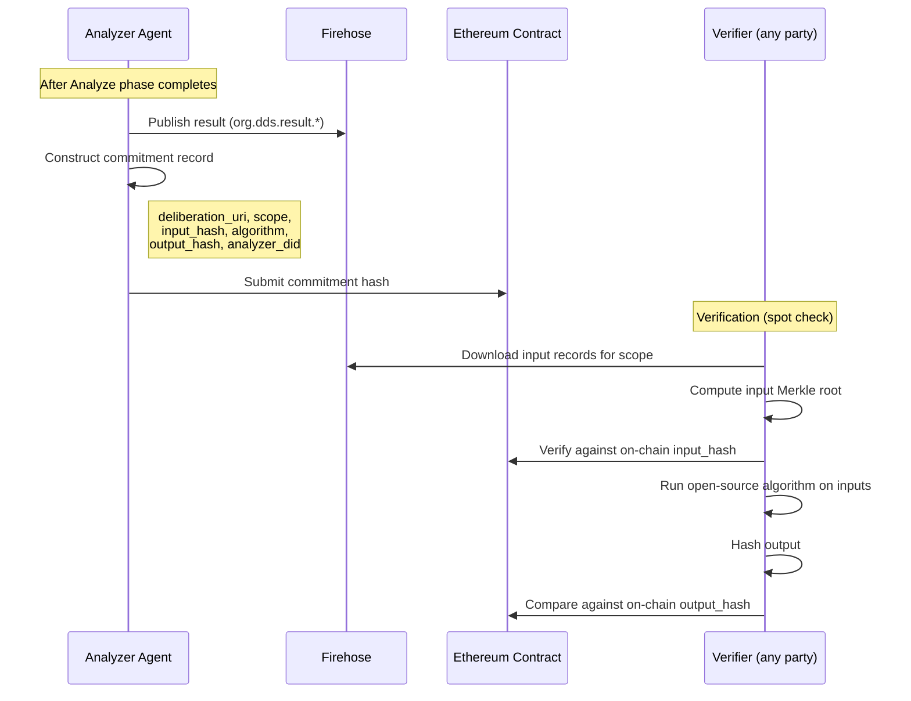

| Metadata       | Value                                                    |
| :------------- | :------------------------------------------------------- |
| **Parent**     | [DDS Spec](./dds-protocol.md)             |
| **Status**     | Draft                                                    |
| **Created**    | 2026-01-13                                               |

This addendum contains implementation-level details for DDS. These are preliminary designs requiring further investigation: they represent directional intent, not finalized specifications.

## 1. Encrypted Key Vault: Cryptographic Design (Optional)

> **Status**: Optional enhancement. This pattern is not required for DDS to function. AT Protocol's `did:plc` rotation keys already enable walkaway. The vault re-adds key-based control for users who don't self-host, giving them greater ownership and censorship resistance through automatic encrypted backup of their rotation keys. This pattern could be proposed as a standardized AT Protocol feature.
>
> **Draft**: The vault designs below (Type A and Type B) are a first proposal. The specific cryptographic primitives (HKDF-SHA256, AES-GCM, did:key exchange keys), key derivation flows, and Lockbox protocol need formal security review before implementation.

### Core Concepts

| Term | Purpose | Mechanism | Trust Requirement |
|------|---------|-----------|-------------------|
| **Encrypted Vault** (`org.dds.key.wrapped`) | Sovereign backup of Rotation Key | Rotation Key encrypted by Master Secret ($K_{account}$), stored in Repository | None (encrypted at rest) |
| **Lockbox** | Add new device to account | $K_{account}$ encrypted for target device's public key | Requires PDS cooperation |
| **Migration (Walkaway)** | Escape malicious/failed PDS | Use decrypted Rotation Key to update `did:plc` document | Sovereign (no PDS needed) |

### 1.1 Type A: Wallet-Derived Vault

For users logging in with an Ethereum Wallet, we use the **"Sign-to-Derive"** pattern (pioneered by Fileverse.io):

1. **Generate**: Client generates a random Recovery Key (`did:plc` rotation key).
2. **Derive**: User signs a deterministic, domain-bound message. The signature seeds **HKDF-SHA256** to derive a symmetric **AES-GCM Key**.
3. **Store**: Recovery Key is encrypted with this AES Key. Ciphertext stored in Repository (`org.dds.key.wrapped`).
4. **Recover**: User can recover identity from any device by re-signing the challenge.

**Reference**: Mirrors `@fileverse/crypto` architecture ([`src/ecies/core.ts`](https://github.com/fileverse/fileverse-cryptography/blob/main/src/ecies/core.ts)), using `@noble/ciphers` and `@noble/hashes`.

### 1.2 Type B: Device Graph Vault

For users without a global key (Email/Phone/Guest):

1. **Master Secret**: Random symmetric key ($K_{account}$) encrypts the user's Rotation Key.
2. **Device Graph**: Each device has a local `did:key` (Exchange Key for encryption).
3. **Lockbox Distribution**: $K_{account}$ is encrypted for each device's Exchange Key, stored in Repository.

**Device Sync Flow**:
1. **Device B (new)**: Generates local `did:key`, displays Public Key via QR Code.
2. **Device A (existing)**: Scans QR, validates fingerprint (MITM protection), encrypts $K_{account}$ for Device B.
3. **Transport**: Device A uploads Lockbox to PDS. Device B downloads, decrypts, accesses Vault.

> **Security**: QR Code verification is MANDATORY. If PDS is known-malicious, don't sync. Decrypt Rotation Key and migrate immediately.

> **Critical**: Users MUST save a Recovery Code (raw $K_{account}$) at signup. Without this or a device, the Rotation Key is irrecoverable: the user loses walkaway capability (cannot migrate to a new PDS) but retains normal PDS access via Email/Phone.

## 2. PDS Hosting & Authentication

### 2.1 Hosting Tiers

> **Note**: The canonical tier definitions are in the [main specification, Hosting Tiers](./dds-protocol.md#hosting-tiers). This section provides implementation details.

| Tier | Name | Description |
|------|------|-------------|
| **2** | Self-Hosted | User brings their own PDS (e.g., standard Bluesky or self-hosted). Direct authentication. |
| **1** | Managed | User authenticates via any accepted credential (e.g., email, phone, wallet, ZK passport). Application auto-provisions a PDS account. |

A single Managed PDS instance is multi-tenant, capable of hosting thousands of accounts (similar to Bluesky PDS architecture).

> **Note**: Guest participation is an orthogonal credential/identity concern, not a hosting tier. "Guest" is an account status encompassing both unverified participants (no credentials, device-bound identity) and soft-verified participants (e.g., ZK-verified event tickets). See [§5](#5-guest-identity-and-account-upgrade) (Guest Identity and Account Upgrade) for detailed analysis.

### 2.2 Authentication

All tiers use standard **AT Protocol OAuth**.

- **Signing**: The PDS manages the Signing Key and signs posts/votes on behalf of the user.
- **Benefit**: Simplified client architecture, compatibility with standard AT Proto clients.
- **Trade-off**: OAuth may be "heavy" for ephemeral guests. Whether to retain it for a unified auth path or use a lighter mechanism for guests is an open question.

### 2.3 The 72h Safety Net

We rely on the **did:plc 72-hour Grace Period**. If a malicious PDS or compromised device rotates keys, the user has 72 hours to undo using their Wallet or Backup Code.

## 3. Security Considerations

### 3.1 MITM on Device Sync

- **Risk**: During Type B sync, a malicious PDS could present its own key instead of the new device's key.
- **Mitigation**: User MUST verify QR Code containing the new device's DID fingerprint. This bypasses server trust.

### 3.2 Public Exposure of Keys

- **Risk**: Encrypted keys are public on the Firehose.
- **Mitigation**: Mandate high-entropy keys. Weak passwords forbidden. Wallet signatures provide mathematical entropy.

### 3.3 Lost Rotation Key

- **Risk**: Type B users lose all devices and have no Recovery Code. They can still authenticate to the PDS (via Email/Phone) and use the account normally, but the Rotation Key is irrecoverable: they lose walkaway capability and cannot migrate if the PDS fails or turns malicious.
- **Mitigation**: Users MUST save Recovery Code at signup. The UI should clearly communicate that this code protects their ability to leave the PDS, not just account access.

### 3.4 Privacy Trade-off

Managed PDS hosts can technically access user data (signing keys, posts). Users requiring full data privacy should self-host their PDS. DDS provides the _capability_ to walk away and self-host, making it a credible choice when needed. Note that data privacy (keeping content secret) is distinct from participant anonymity (hiding who said what). The latter does not require self-hosting. See [Anonymity Addendum](./anonymity-addendum.md) for deeper analysis.

## 4. Open Issues

### 4.1 Fraud Proving Mechanism (zkML)

> **Status**: Active research area. Some use-cases are feasible today; others require further progress.

On-chain re-execution is infeasible for heavy analysis algorithms (PCA, LLM inference) on standard EVM chains. The emerging solution is **zkML (Zero-Knowledge Machine Learning)**.

**The core idea, asymmetric verification**: With zkML, proving is expensive (done once, by the Analyzer), but **verifying is cheap** (done by anyone, instantly, without access to the original data). This is the key property:

1. **Analyzer** (expensive, done once): Runs the full analysis on the dataset, then generates a small cryptographic proof (~kilobytes) alongside the result.
2. **Any client** (cheap, done by anyone): Fetches the result + the proof. Runs a verification function in ~50 milliseconds. No data access needed, no re-running the algorithm, no infrastructure. Just math.

Without zkML, verifying an Analyzer's result requires downloading ALL the input data from the Firehose and re-running the entire computation (the Spot Check level). With zkML, you just check the proof. The proof is self-contained and mathematically guarantees that the Analyzer ran the claimed algorithm on the claimed inputs and got the claimed output.

**How it works in practice**: An Analyzer Agent converts its analysis pipeline (e.g., an ONNX model) into an arithmetic circuit using a framework like [EZKL](https://github.com/zkonduit/ezkl). It runs the computation and generates a ZK proof (e.g., using Halo2 or zkSTARKs). The proof, along with commitments to the inputs and outputs, is posted on-chain. Anyone can verify the proof cheaply (on a phone, in a browser) with mathematical certainty that the computation was faithful.

**Practical feasibility (as of early 2025):**

| Analysis Type | Feasibility | Proving Time | Notes |
|---------------|-------------|-------------|-------|
| Vote tallying / consensus metrics | Ready | Seconds | Arithmetic operations; well-suited to ZK circuits |
| Clustering (PCA + K-means) | Feasible | 10-30 sec (100-1K participants) | Matrix operations are provable; scales linearly |
| Small model classification (<18M params) | Ready | ~6 seconds | EZKL can prove any ONNX model |
| LLM summary verification (7B+ params) | Not yet practical | Minutes per token | Active research ([Lagrange](https://lagrange.dev/), [zkPyTorch](https://github.com/polyhedra-network)); expect 2026+ |

**Leading frameworks:**
- **[EZKL](https://github.com/zkonduit/ezkl)**: Most production-ready. Converts ONNX models to Halo2 circuits. Generic (any ONNX model). Open source.
- **[Lagrange](https://lagrange.dev/)**: Focused on large model proving. First to prove full LLM inference end-to-end.
- **[Giza/Orion](https://www.gizatech.xyz/)**: zkSTARKs via Cairo on Starknet. Distributed proof generation.
- **[zkPyTorch](https://github.com/polyhedra-network)**: Hierarchical compiler optimizations. Strong benchmark results.

**Phased deployment for DDS:**
1. **Now**: Hash-based result commitment ([§6](#6-result-commitment-protocol)) + Spot Check (deterministic re-execution). No ZK proofs required.
2. **Near-term**: Add zkML proofs for vote tallying and clustering verification. These are feasible today and cover the most critical audit need: "was the consensus computed correctly?"
3. **Future**: zkML proofs for LLM-based analysis as the technology matures.

**Alternative approach, Optimistic Dispute:**
For analysis types where zkML is not yet feasible (e.g., LLM summaries), an optimistic dispute mechanism remains an option: results are presumed correct unless challenged, and a committee of independent parties re-runs the computation off-chain to resolve disputes. This is less elegant than zkML but practical today.

**Relationship to result commitment:**
zkML and result commitment ([§6](#6-result-commitment-protocol)) are complementary:
- Result commitment proves **integrity**: "this result hasn't been modified since publication" (hash on-chain)
- zkML proves **correctness**: "the computation that produced this result was executed faithfully" (ZK proof on-chain)
- Together: end-to-end verifiability. The result is both correct and immutable.

**References:**
- [A Survey of Zero-Knowledge Proof Based Verifiable Machine Learning](https://arxiv.org/abs/2502.18535)
- [The Definitive Guide to ZKML (2025)](https://blog.icme.io/the-definitive-guide-to-zkml-2025/)

### 4.2 Data Availability Attack

> **Status**: Requires client mitigation

**Risk**: A malicious PDS could accept the User's Vault commit and report success, but refuse to publish it to the Firehose. Archive Agents never see the data. If PDS deletes account, user is lost.

**Mitigation**: Clients may need to poll independent Archive Agents to confirm their Vault has been indexed before considering setup "safe."

## 5. Guest Identity and Account Upgrade

> **Status**: Open design question, first priority to resolve
>
> **Scope**: This section describes a pattern intended for AT Protocol itself, not specific to DDS. Any AT Protocol application that needs lightweight participation (event apps, polls, feedback forms, onboarding flows) faces the same guest identity and account upgrade problem. A standardized Guest Mode pattern, potentially as a Lexicon, would be reusable across the ecosystem. The design exploration lives in the DDS spec for now because DDS is the motivating use case.

### 5.1 The Problem

In centralized deliberation platforms, guest accounts are straightforward: a temporary identifier is created, and when a guest later upgrades to a verified account (e.g., adds email or phone), the platform transfers all their data to the new account. This works because records aren't cryptographically bound to the guest's identity.

On AT Protocol, records are signed by the originating DID. The protocol doesn't currently account for this kind of identity merge.

In practice, "guest" encompasses at least two distinct participation modes with very different properties:

1. **Unverified guest (pure guest)**: Zero credentials. The application creates a device-bound identity (e.g., a UUID and random username). No ZK verification, no sybil resistance. The goal is to minimize friction: no login, no signup, immediate participation. Common use cases include no-login public Polis-like deliberations, in-person sessions at conferences or citizen assemblies, and link-gated deliberations shared via a trusted private group chat.

2. **Soft-verified guest (e.g., ticket-gated)**: The participant holds a soft credential, such as a Zupass event ticket, verified via ZK proof. No hard credential (phone, email, passport) is required. ZK nullifiers add sybil resistance, scoped either per deliberation or network-wide. Common use cases include event-scoped deliberations at conferences, membership-gated consultations, and any context where eligibility must be proven without registration.

Both are "guests" (absence of hard credentials), but they differ fundamentally: unverified guests have no sybil resistance and no verification, while soft-verified guests have context-scoped sybil resistance via ZK proofs. The identity levels from the [main specification](./dds-protocol.md#participant-identity-levels) apply as follows:

- Both unverified and soft-verified guests operate at Level 2 (persistent identifier) or Level 3 (per-deliberation identifier). The identity level describes what other participants see, and both guest types are anonymous.
- The difference is sybil resistance: soft-verified guests have it (via ZK nullifiers), unverified guests do not.

Two factors complicate the design:

1. **Infrastructure overhead.** AT Protocol requires a PLC directory entry, a PDS account, and a repository. `did:plc` is the standard identity method, giving full compatibility with Labelers, Firehose, moderation, and OAuth. But for a conference attendee who votes once via a Zupass ticket, this is disproportionate: rotation keys, recovery vaults, and PDS provisioning serve no purpose in a one-off interaction. `did:key` (a DID that directly encodes a public key) is lightweight, with no directory registration or PDS provisioning, but it is second-class in the AT Protocol ecosystem: moderation tools, Firehose indexing, and OAuth all assume `did:plc`.

2. **Per-deliberation anonymity.** Some deliberation contexts require unlinkability across sessions. For example, ZK nullifiers can be scoped per event (e.g., `externalNullifier = "dds-${eventSlug}-v1"`), ensuring one credential maps to one participant per deliberation, unlinkable across deliberations. A single `did:plc` is linkable across deliberations, defeating this purpose. Per-deliberation anonymity requires a fresh identifier per context.

### 5.2 Guest Representation

All use cases, whether unverified participants, soft-verified participants, or imported external data, need a guest representation in the lexicon. The question is: what identifier to use?

| Option | Weight | AT Protocol compatibility | Records live in | Upgrade |
|--------|--------|--------------------------|-----------------|---------|
| **Plain UUID** | Lightest | None (opaque identifier in lexicon data) | Managed PDS | Re-attribute internally |
| **`did:key`** | Light | Second-class (Labelers, Firehose, OAuth assume `did:plc`) | Managed PDS, attributed to `did:key` in record data | Mutual attestation or re-signing |
| **Managed `did:plc`** | Heavy (PLC directory, PDS, rotation keys) | Full (Labelers, Firehose, OAuth, moderation) | Guest's own repository | Add credentials to same account |

With `did:plc`, guest records are first-class: they live in the guest's own repository, appear on the Firehose under the guest's DID, and work with standard moderation tools. With `did:key` or UUID, records live in the Managed PDS, attributed to the guest in the record data. This makes them second-class for Firehose indexing and moderation, but lighter.

For per-deliberation anonymity (Level 3), the identifier must be fresh per context. `did:key` (new keypair per deliberation) or UUID works. `did:plc` is linkable across deliberations by design, so it is wrong for this case.

### 5.3 Account Upgrade

**Account creation from guest.** The guest decides to register (e.g., verifies an email). With `did:plc` guests, credentials are added to the existing account. With `did:key` or UUID guests, a new `did:plc` is created and the guest history is merged into it automatically. The mechanism differs, but the UX is the same: sign up, and previous contributions follow.

**Merge into existing account.** The user already has a `did:plc` account with its own history and wants to absorb guest history into it. This is the harder problem:

- **UUID → existing `did:plc`**: Easiest. The PDS re-signs the records with the participant field updated to the new DID. Since UUIDs are opaque app-level identifiers with no cryptographic binding, nothing external needs to change.
- **`did:key` → existing `did:plc`**: Mutual attestation. The `did:plc` signs that it now owns `did:key`, `did:key` signs that it agrees. Records signed by `did:key` are now claimed by `did:plc`. Alternatively, `did:plc` re-signs everything.
- **`did:plc` (guest) → existing `did:plc`**: Same mutual attestation pattern. Both DIDs sign that they recognize the merge. This is only valid when one account is a guest (no hard credentials). The managed PDS operator facilitates the merge, which places significant trust in the operator and should not be taken lightly.

For soft-verified guests, the ZK nullifier serves as the proof mechanism for merge authorization: the `did:plc` account re-verifies the same ticket, producing the same nullifier, which proves they are the same person as the guest. This authorizes the merge.

When records are re-signed or re-published during upgrade, they may appear as new records on the Firehose (new CIDs, new timestamps), potentially affecting indexers, moderation history, and audit trails. This needs investigation.

## 6. Result Commitment Protocol

> **Note**: The commitment format is defined in the [main specification, Result Commitment](./dds-protocol.md#84-result-commitment). This section provides the protocol flow and implementation details.
>
> **Status**: Draft design, needs smart contract specification
>
> Inspired by [Vocdoni](https://vocdoni.io/)'s DAVINCI architecture for notarizing election results on Ethereum. Adapted for DDS where AT Protocol serves as the data layer.

### 6.1 Motivation

DDS publishes deliberation results (`org.dds.result.*`, e.g., PCA clustering, LLM summaries) to the AT Protocol Firehose. But Firehose records can be updated or deleted by the originating PDS. For finished consultations, results should be **permanent and tamper-evident**, anchored to a commitment that no single operator can modify.

This is distinct from the fraud proving problem ([§4.1](#41-fraud-proving-mechanism)). Fraud proving asks: "was the computation correct?" Result commitment asks: "has the result been modified since publication?" The former requires ZK proofs or re-execution. The latter requires only a hash.

### 6.2 Protocol

After the Analyze phase completes:

**Analyzer Agent:**

1. Publishes result record to AT Protocol (e.g., `org.dds.result.pca`, `org.dds.result.summary`).
2. Constructs a commitment record containing:
   - `deliberation_uri`: AT Protocol URI of the deliberation process
   - `scope`: `{ start_time, end_time }` (time window of analysis)
   - `input_hash`: Merkle root of all input records in scope (e.g., `org.dds.module.polis.vote` + opinion, or any module's records)
   - `algorithm`: identifier + version (e.g., `reddwarf@2.1.0`, `summarizer@1.0.0`)
   - `output_hash`: SHA-256 of the result record
   - `analyzer_did`: Analyzer Agent's DID
3. Submits commitment hash to Ethereum smart contract.

The commitment transaction can be submitted by the Analyzer, the Organizer, or any party, as the data is public on the Firehose.

**Verifier (any party):**

1. Downloads all input records from AT Protocol Firehose for the scope.
2. Computes input Merkle root, verifies against on-chain `input_hash`.
3. Runs algorithm (open-source) on the inputs.
4. Hashes the output, compares against on-chain `output_hash`.
5. If mismatch: the Analyzer either computed incorrectly or results were modified.

### 6.3 Comparison with Vocdoni (DAVINCI)

| Aspect | Vocdoni (DAVINCI) | DDS |
|--------|-------------------|-----|
| **Data** | Raw votes in Ethereum data blobs (EIP-4844) or IPFS | Participant input as AT Protocol Firehose records (any `org.dds.module.*`) |
| **Coordination** | Ethereum smart contracts | Ethereum smart contract (commitment hash) |
| **Processing** | Off-chain sequencers submit ZK proofs on-chain | Analyzer Agents run analysis off-chain (clustering, LLM, etc.) |
| **Verification** | ZK-SNARKs prove vote validity + state transitions | Deterministic re-execution on public Firehose data |

Both use Ethereum as a coordination/commitment layer, both store raw data off-chain (blobs/IPFS vs. AT Protocol), and both enable public verification without trusting operators. The key differences: Vocdoni uses ZK proofs for computation correctness (trustless), while DDS uses deterministic re-execution (spot-check, with ZK as future work). Vocdoni is purpose-built for voting; DDS reuses AT Protocol, a general-purpose social data layer.

### 6.4 Potential Collaboration

DDS and DAVINCI address different phases of governance: DDS handles deliberation (surfacing opinions, clustering, sensemaking), DAVINCI handles voting (secure, anonymous, verifiable decisions). They're complementary, and the most natural collaboration point is shared semantic data on AT Protocol.

**Data interoperability:**
- DDS publishes consultation results as AT Protocol records (lexicons).
- DAVINCI could publish election configs, census criteria, and results as AT Protocol records, creating a shared data lake with voting-specific infrastructure.
- DDS analysis results inform ballot design (what gets voted on).
- Vote results flow back as records that DDS apps can reference.

**Shared infrastructure:**
- Ethereum: Both use it as a coordination/commitment layer (DDS for result hashes, DAVINCI for election settlement).
- AT Protocol identity: DDS credentials (Zupass, ZK passport, DIDs) could feed DAVINCI voter eligibility / census.

Voting has requirements that deliberation doesn't: ballot secrecy, coercion resistance, exact tallying with ZK proofs. DAVINCI's architecture is purpose-built for these constraints. The collaboration pattern is at the data layer (shared lexicons, shared identity), not infrastructure merging, and it generalizes beyond Vocdoni to any voting protocol (e.g. [Freedom Tool](https://freedomtool.org/), [CarbonVote](https://www.carbonvote.com/)) that could publish metadata and results as AT Protocol records.

### 6.5 Open Questions

- **Chain selection**: Ethereum L1 vs L2 (Optimism, Base, etc.), trade-off between cost and security guarantees
- **Smart contract design**: Minimal contract that stores commitment hashes, indexed by deliberation URI
- **Input hash construction**: Exact Merkle tree specification for deterministic input hashing (ordering, canonicalization)
- **Timing**: When exactly is a consultation "finished"? Who triggers the commitment? Can multiple Analyzers' results be committed? How are competing results handled?
- **Who commits?**: The Analyzer, the Organizer, or any party? This is a governance question. The protocol should define the commitment format but leave the committer open.
- **Cost**: Gas optimization, batching multiple consultation commitments, or using blob transactions (EIP-4844)
- **Relationship to archival**: Archive Agents (Arweave/Filecoin) store full data; Ethereum stores only hashes. Both serve durability but at different layers.
- **Relationship to zkML**: As zkML matures, Analyzer Agents could post both a result hash (integrity) and a zkML proof (correctness) to the same Ethereum commitment. The smart contract design should anticipate an optional proof field alongside the hash. See [§4.1](#41-fraud-proving-mechanism-zkml) for zkML assessment.

## 7. Deliberation Access

> **Note**: The three access modes are defined in the [main specification, Deliberation Access](./dds-protocol.md#9-deliberation-access). This section provides mechanism details and open questions.
>
> **Status**: Open design question
>
> Distinct from participant anonymity ([Anonymity Addendum](./anonymity-addendum.md)). Deliberation access restricts who can participate in or access a deliberation.

### 7.1 The Problem

Organizers often need frictionless deliberations (no login required) restricted to a select group of invited people. The link to participate shouldn't leak to unintended participants.

On AT Protocol, records are published to the Firehose. A cleartext password/token in the data would be visible to any Firehose consumer.

### 7.2 Access Modes

#### Participation-gated (common need)

The deliberation is publicly viewable, viewing is fine. Only people with the link can submit opinions and votes.

**Mechanism:**

1. Organizer generates a signing keypair.
2. Private key is embedded in the share link (URL fragment after `#`, never sent to the server).
3. Public key is published in deliberation metadata (not secret).
4. Participants sign their submissions with the private key.
5. Analyzer/AppView only accepts records with valid signatures.
6. The signing key never appears in AT Protocol records, only signatures do.

**Properties:**
- Deliberation content remains public and verifiable.
- No encryption complexity.
- Signing key never leaves the client (URL fragment).
- Anyone can verify signatures against the public key.
- If the link leaks, anyone with it can participate.
- Revoking access requires a new keypair and a new link.

#### Restricted (rare, not a current need)

The deliberation can't even be viewed by outsiders.

**Mechanism:**

1. Organizer generates a symmetric encryption key K.
2. K is embedded in the share link (URL fragment after `#`).
3. All records are encrypted with K before writing to the PDS.
4. Firehose sees ciphertext only.
5. Having K = having access (no gatekeeper).

**Properties:**
- Trust-minimized: PDS/Firehose see nothing.
- Analyzer Agent needs K (organizer must share explicitly).
- Revoking access is impossible (the key is symmetric and already distributed).
- Not a current need; no use case observed yet.

### 7.3 Link Structure

- **Participation-gated**: `https://app.example.com/deliberation/slug-id#key=<base64url(signingPrivateKey)>`
- **Restricted**: `https://app.example.com/deliberation/slug-id#secret=<base64url(encryptionKey)>`

The URL fragment (after `#`) is never sent to the server in HTTP requests and is available to client-side JavaScript only.

### 7.4 Open Questions

- **Key format**: Which signing algorithm for the participation-gated key? Ed25519 (Web Crypto compatible, non-exportable storage possible) or P-256?
- **Revocation**: If the link leaks, the deliberation is compromised. Acceptable for many use cases (same as password-protected links), but not all.
- **Analyzer key distribution** (restricted mode only): How does the Analyzer Agent get K? Options: organizer sends it out-of-band, or K is encrypted for the Analyzer's public key in deliberation metadata.
- **Record format**: How are signed/encrypted records structured in the Lexicon?
- **Partial restriction**: Can some records be public (deliberation title, metadata) while submissions require signing?
