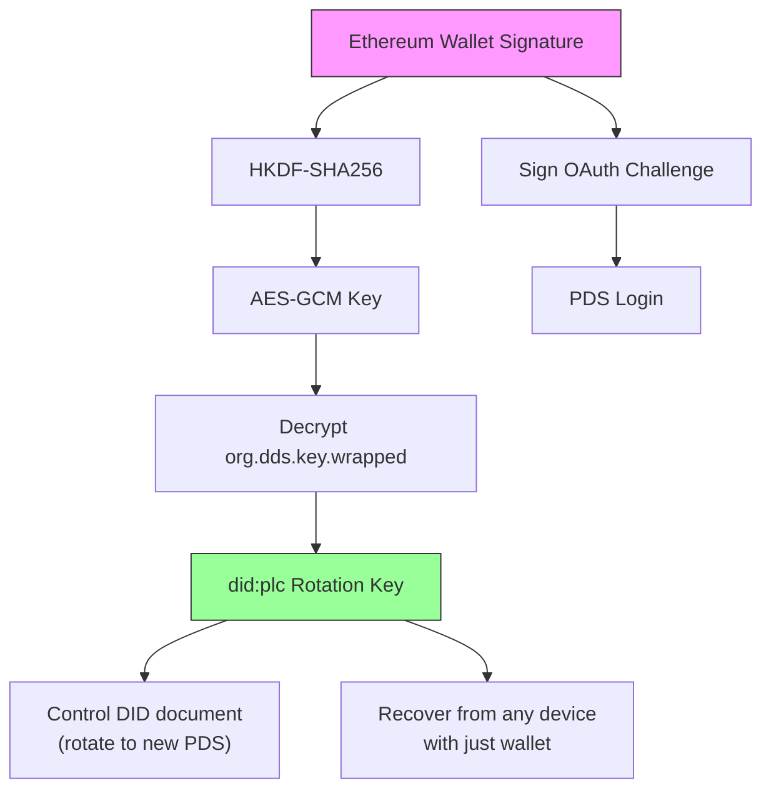
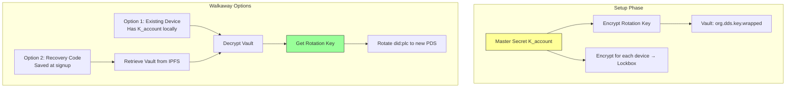

| Metadata       | Value                                                    |
| :------------- | :------------------------------------------------------- |
| **Parent**     | [DDS Spec](./dds-protocol.md)             |
| **Status**     | Draft                                                    |
| **Created**    | 2026-01-13                                               |

This addendum contains implementation-level details for DDS. These are preliminary designs requiring further investigation: they represent directional intent, not finalized specifications.

## 1. Encrypted Key Vault: Cryptographic Design (Optional)

> **Status**: Optional enhancement. This pattern is not required for DDS to function. AT Protocol's `did:plc` rotation keys already enable walkaway. The vault adds automatic encrypted backup, removing the burden of manual key management. This pattern could be proposed as a standardized AT Protocol feature.
>
> **Draft**: The vault designs below (Type A and Type B) are a first proposal. The specific cryptographic primitives (HKDF-SHA256, AES-GCM, did:key exchange keys), key derivation flows, and Lockbox protocol need formal security review before implementation.

### Core Concepts

| Term | Purpose | Mechanism | Trust Requirement |
|------|---------|-----------|-------------------|
| **Encrypted Vault** (`org.dds.key.wrapped`) | Sovereign backup of Rotation Key | Rotation Key encrypted by Master Secret ($K_{account}$), stored in Repository | None (encrypted at rest) |
| **Lockbox** | Add new device to account | $K_{account}$ encrypted for target device's public key | Requires PDS cooperation |
| **Migration (Walkaway)** | Escape malicious/failed PDS | Use decrypted Rotation Key to update `did:plc` document | Sovereign (no PDS needed) |

### 1.1 Type A: Wallet-Derived Vault

For users logging in with an Ethereum Wallet, we use the **"Sign-to-Derive"** pattern (pioneered by Fileverse.io):

1. **Generate**: Client generates a random Recovery Key (`did:plc` rotation key).
2. **Derive**: User signs a deterministic, domain-bound message. The signature seeds **HKDF-SHA256** to derive a symmetric **AES-GCM Key**.
3. **Store**: Recovery Key is encrypted with this AES Key. Ciphertext stored in Repository (`org.dds.key.wrapped`).
4. **Recover**: User can recover identity from any device by re-signing the challenge.

**Reference**: Mirrors `@fileverse/crypto` architecture ([`src/ecies/core.ts`](https://github.com/fileverse/fileverse-cryptography/blob/main/src/ecies/core.ts)), using `@noble/ciphers` and `@noble/hashes`.



### 1.2 Type B: Device Graph Vault

For users without a global key (Email/Phone/Guest):

1. **Master Secret**: Random symmetric key ($K_{account}$) encrypts the user's Rotation Key.
2. **Device Graph**: Each device has a local `did:key` (Exchange Key for encryption).
3. **Lockbox Distribution**: $K_{account}$ is encrypted for each device's Exchange Key, stored in Repository.

**Device Sync Flow**:
1. **Device B (new)**: Generates local `did:key`, displays Public Key via QR Code.
2. **Device A (existing)**: Scans QR, validates fingerprint (MITM protection), encrypts $K_{account}$ for Device B.
3. **Transport**: Device A uploads Lockbox to PDS. Device B downloads, decrypts, accesses Vault.

> **Security**: QR Code verification is MANDATORY. If PDS is known-malicious, don't sync. Decrypt Rotation Key and migrate immediately.



> **Critical**: Users MUST save a Recovery Code (raw $K_{account}$) at signup. Without this or a device, the Rotation Key is irrecoverable: the user loses walkaway capability (cannot migrate to a new PDS) but retains normal PDS access via Email/Phone.

## 2. PDS Hosting & Authentication

### 2.1 Hosting Tiers

> **Note**: The canonical tier definitions are in the [main specification, Hosting Tiers](./dds-protocol.md#hosting-tiers). This section provides implementation details.

| Tier | Name | Description |
|------|------|-------------|
| **2** | Self-Hosted | User brings their own PDS (e.g., standard Bluesky or self-hosted). Direct authentication. |
| **1** | Managed | User authenticates via any accepted credential (email, phone, wallet, ZK passport, etc.). Application auto-provisions a PDS account. |
| **0** | Guest | Guest user with no verified identifier. Identity may be managed `did:plc` (for persistent pseudonymous participation) or `did:key` (for per-deliberation anonymity, external data imports). See [§5](#5-guest-identity-and-account-upgrade) for design exploration. |

A single Managed PDS instance is multi-tenant, capable of hosting thousands of accounts (similar to Bluesky PDS architecture).

> **Note**: The Tier 0 design is an open question. See [§5](#5-guest-identity-and-account-upgrade) (Guest Identity and Account Upgrade) for detailed analysis of the trade-offs between managed `did:plc` and `did:key` for guest participation.

### 2.2 Authentication

All tiers use standard **AT Protocol OAuth**.

- **Signing**: The PDS manages the Signing Key and signs posts/votes on behalf of the user.
- **Benefit**: Simplified client architecture, compatibility with standard AT Proto clients.
- **Trade-off**: OAuth may be "heavy" for ephemeral Guests. Whether to retain it for a unified auth path or use a lighter mechanism for Guests is TBD.

### 2.3 The 72h Safety Net

We rely on the **did:plc 72-hour Grace Period**. If a malicious PDS or compromised device rotates keys, the user has 72 hours to undo using their Wallet or Backup Code.

## 3. Security Considerations

### 3.1 MITM on Device Sync

- **Risk**: During Type B sync, a malicious PDS could present its own key instead of the new device's key.
- **Mitigation**: User MUST verify QR Code containing the new device's DID fingerprint. This bypasses server trust.

### 3.2 Public Exposure of Keys

- **Risk**: Encrypted keys are public on the Firehose.
- **Mitigation**: Mandate high-entropy keys. Weak passwords forbidden. Wallet signatures provide mathematical entropy.

### 3.3 Lost Rotation Key

- **Risk**: Type B users lose all devices and have no Recovery Code. They can still authenticate to the PDS (via Email/Phone) and use the account normally, but the Rotation Key is irrecoverable: they lose walkaway capability and cannot migrate if the PDS fails or turns malicious.
- **Mitigation**: Users MUST save Recovery Code at signup. The UI should clearly communicate that this code protects their ability to leave the PDS, not just account access.

### 3.4 Privacy Trade-off

Managed PDS hosts can technically access user data (signing keys, posts). Users requiring full data privacy should self-host their PDS. DDS provides the _capability_ to walk away and self-host, making it a credible choice when needed. Note that data privacy (keeping content secret) is distinct from participant anonymity (hiding who said what). The latter does not require self-hosting. See [Anonymity Addendum](./anonymity-addendum.md) for deeper analysis.

## 4. Open Issues

### 4.1 Fraud Proving Mechanism (zkML)

> **Status**: Active research area. Some use-cases are feasible today; others require further progress.

On-chain re-execution is infeasible for heavy analysis algorithms (PCA, LLM inference) on standard EVM chains. The emerging solution is **zkML (Zero-Knowledge Machine Learning)**.

**The core idea, asymmetric verification**: With zkML, proving is expensive (done once, by the Analyzer), but **verifying is cheap** (done by anyone, instantly, without access to the original data). This is the key property:

1. **Analyzer** (expensive, done once): Runs the full analysis on the dataset, then generates a small cryptographic proof (~kilobytes) alongside the result.
2. **Any client** (cheap, done by anyone): Fetches the result + the proof. Runs a verification function in ~50 milliseconds. No data access needed, no re-running the algorithm, no infrastructure. Just math.

Without zkML, verifying an Analyzer's result requires downloading ALL the input data from the Firehose and re-running the entire computation (the Spot Check level). With zkML, you just check the proof. The proof is self-contained and mathematically guarantees that the Analyzer ran the claimed algorithm on the claimed inputs and got the claimed output.

**How it works in practice**: An Analyzer Agent converts its analysis pipeline (e.g., an ONNX model) into an arithmetic circuit using a framework like [EZKL](https://github.com/zkonduit/ezkl). It runs the computation and generates a ZK proof (e.g., using Halo2 or zkSTARKs). The proof, along with commitments to the inputs and outputs, is posted on-chain. Anyone can verify the proof cheaply (on a phone, in a browser) with mathematical certainty that the computation was faithful.

**Practical feasibility (as of early 2025):**

| Analysis Type | Feasibility | Proving Time | Notes |
|---------------|-------------|-------------|-------|
| Vote tallying / consensus metrics | Ready | Seconds | Arithmetic operations; well-suited to ZK circuits |
| Clustering (PCA + K-means) | Feasible | 10-30 sec (100-1K participants) | Matrix operations are provable; scales linearly |
| Small model classification (<18M params) | Ready | ~6 seconds | EZKL can prove any ONNX model |
| LLM summary verification (7B+ params) | Not yet practical | Minutes per token | Active research ([Lagrange](https://lagrange.dev/), [zkPyTorch](https://github.com/polyhedra-network)); expect 2026+ |

**Leading frameworks:**
- **[EZKL](https://github.com/zkonduit/ezkl)**: Most production-ready. Converts ONNX models to Halo2 circuits. Generic (any ONNX model). Open source.
- **[Lagrange](https://lagrange.dev/)**: Focused on large model proving. First to prove full LLM inference end-to-end.
- **[Giza/Orion](https://www.gizatech.xyz/)**: zkSTARKs via Cairo on Starknet. Distributed proof generation.
- **[zkPyTorch](https://github.com/polyhedra-network)**: Hierarchical compiler optimizations. Strong benchmark results.

**Phased deployment for DDS:**
1. **Now**: Hash-based result commitment ([§6](#6-result-commitment-protocol)) + Spot Check (deterministic re-execution). No ZK proofs required.
2. **Near-term**: Add zkML proofs for vote tallying and clustering verification. These are feasible today and cover the most critical audit need: "was the consensus computed correctly?"
3. **Future**: zkML proofs for LLM-based analysis as the technology matures.

**Alternative approach, Optimistic Dispute:**
For analysis types where zkML is not yet feasible (e.g., LLM summaries), an optimistic dispute mechanism remains an option: results are presumed correct unless challenged, and a committee of independent parties re-runs the computation off-chain to resolve disputes. This is less elegant than zkML but practical today.

**Relationship to result commitment:**
zkML and result commitment ([§6](#6-result-commitment-protocol)) are complementary:
- Result commitment proves **integrity**: "this result hasn't been modified since publication" (hash on-chain)
- zkML proves **correctness**: "the computation that produced this result was executed faithfully" (ZK proof on-chain)
- Together: end-to-end verifiability. The result is both correct and immutable.

**References:**
- [A Survey of Zero-Knowledge Proof Based Verifiable Machine Learning](https://arxiv.org/abs/2502.18535)
- [The Definitive Guide to ZKML (2025)](https://blog.icme.io/the-definitive-guide-to-zkml-2025/)

### 4.2 Data Availability Attack

> **Status**: Requires client mitigation

**Risk**: A malicious PDS could accept the User's Vault commit and report success, but refuse to publish it to the Firehose. Archive Agents never see the data. If PDS deletes account, user is lost.

**Mitigation**: Clients may need to poll independent Archive Agents to confirm their Vault has been indexed before considering setup "safe."

## 5. Guest Identity and Account Upgrade

> **Status**: Open design question, first priority to resolve
>
> This is a problem worth solving at the AT Protocol level, not just for DDS. A standardized Guest Mode pattern, potentially as a Lexicon, would be reusable by any AT Protocol application that needs to support lightweight participation with upgrade to persistent accounts.

### 5.1 The Problem

In centralized deliberation platforms, guest accounts are straightforward: a temporary identifier is created, and when a guest later upgrades to a verified account (e.g., adds phone or ZK passport), the platform transfers all their data to the new account. This works because records aren't cryptographically bound to the guest's identity.

On AT Protocol, records are signed by the originating DID. The protocol doesn't currently account for this kind of identity merge.

Three factors complicate the design:

```
1. INFRASTRUCTURE OVERHEAD:
   AT Protocol requires: PLC directory entry + PDS account + repository
   Nostr requires:       Generate secp256k1 keypair (client-side only,
                          but secp256k1 not in Web Crypto API, private
                          key unavoidably exposed to JS for guests)
   Logos Messaging requires: Nothing (P2P, no identity infrastructure,
                          but ecosystem uses secp256k1, same Web Crypto
                          limitation as Nostr)

   For a conference attendee who votes once via Zupass ticket,
   did:plc is overengineered. Rotation keys, recovery vaults,
   PDS provisioning: none of this matters for a one-off interaction.

2. PER-DELIBERATION ANONYMITY:
   Ticket-gated deliberations use ZK nullifiers scoped per event/deliberation
   (e.g., externalNullifier = "dds-${eventSlug}-v1").
   Design: 1 ticket = 1 person for THIS deliberation, unlinkable across deliberations.
   A single did:plc is linkable across deliberations, defeating the purpose.
   Per-deliberation anonymity requires per-deliberation identifiers (DID method TBD; did:key is one candidate).

3. EXTERNAL DATA:
   Data arrives from other tools (deliberation platforms, voting apps, social media APIs)
   via SDK integration. These participants don't have AT Protocol accounts.
   Their contributions need representation in the lexicon data
   without requiring PDS provisioning.
```

### 5.2 Design Approaches

```
APPROACH A: Managed did:plc for guests
  • AppView manages a multi-tenant PDS, auto-provisions did:plc for every participant
  • Full AT Protocol compatibility (Labelers, Firehose, moderation)
  • Records properly attributed from day one
  ✅ If guest adds credentials to SAME account: trivial upgrade (no merge)
  ❌ If guest later creates SEPARATE verified account: merge still needed
     (guest did:plc:A proved ticket → email account did:plc:B can't re-prove
      same ticket → nullifier collision → two accounts, same person, stuck)
  ❌ PLC directory overhead, rotation keys unnecessary for ephemeral use
  ❌ Single did:plc is linkable across deliberations, breaks per-deliberation anonymity
  ❌ Doesn't work for external data imports (participants without PDS)

APPROACH B: did:key "soft accounts" within lexicon data
  • Guests use client-generated did:key (or app-generated on their behalf)
  • Records stored in app's PDS, attributed to guest's did:key in the data
  • Per-deliberation did:key enables unlinkable ticket-gated participation
  • Works for external data imports (assign did:key to external participants)
  ✅ Lightweight: no PDS provisioning, no PLC directory
  ✅ Supports per-deliberation anonymity (different did:key per context)
  ✅ Works for external data (Twitter/X users, other app SDK data)
  ❌ did:key is second-class in AT Protocol ecosystem
  ❌ Moderation tools (Labelers) need adaptation for did:key actors
  ❌ Upgrade to did:plc requires attestation or re-publication of records
  ❌ Records signed with did:key cannot be re-signed with did:plc
  ❌ Different auth mechanism than standard AT Protocol OAuth

APPROACH C: Hybrid (likely direction)
  • did:key for guest/ephemeral/ticket-gated/external participation
  • did:plc for committed users
  • AppView manages guest did:key records in its own PDS
  • Standardized attestation/merge to link did:key history to did:plc on upgrade
  ✅ Right tool for each use case
  ❌ Two identity formats in the system
  ❌ Attestation/merge protocol needs careful design
```

### 5.3 The Merge Problem

The merge problem exists regardless of approach. It's inherent to any system where a user may interact before creating a persistent identity.

```
SCENARIO: Guest proves ticket, later creates real account

WITH did:plc (Approach A):
  1. Guest proves Zupass ticket → did:plc:guest created
  2. Later, same person logs in with email → did:plc:email created
  3. Tries to prove same ticket on email account
  4. Nullifier already used by did:plc:guest → REJECTED
  5. Need: merge did:plc:guest INTO did:plc:email
  6. Problem: Records in guest's repository signed by did:plc:guest
     Cannot be moved to email's repository (different DID)
  7. Options:
     a. Application-level merge (AppView treats both DIDs as same user)
     b. AT Protocol account merge (not natively supported)
     c. Re-publish records from new DID (lose original signatures/CIDs)

WITH did:key (Approach B):
  1. Guest proves ticket → did:key:guest (ephemeral)
  2. Later, same person creates account → did:plc:email
  3. Tries to prove same ticket on real account
  4. Nullifier already used → REJECTED
  5. Need: link did:key:guest to did:plc:email
  6. Problem: Records attributed to did:key:guest in app's PDS
  7. Options:
     a. Signed attestation: did:plc:email claims did:key:guest history
     b. App-level linkage (simpler but less verifiable)
     c. Re-publish under did:plc:email (lose original attribution)

BOTH APPROACHES require merge/link design.
Neither eliminates it entirely.
```

### 5.4 Current Assessment

This is an open design question requiring prototyping. Current thinking:

**Per-deliberation anonymous participation → ephemeral per-deliberation identifier (DID method TBD; `did:key` is the current candidate, but managed `did:plc` or other approaches remain possible).**
A single persistent identifier is linkable across deliberations and defeats the purpose of per-deliberation anonymity. The ZK nullifier model aligns with ephemeral per-deliberation identifiers.

**External data imports → `did:key` (or reference identifiers).**
Participants from other tools and SDK integrations don't have AT Protocol accounts. Their contributions must be representable without PDS provisioning.

**Persistent accounts → `did:plc`.**
Full moderation compatibility, walkaway capability, Firehose integration.

**Upgrade path → needs design work regardless.**
- `did:plc` approach: needs application-level or AT Protocol-level account merge
- `did:key` approach: needs attestation protocol for linking ephemeral to persistent identity
- Trade-off: `did:plc` merge preserves more AT Protocol compatibility; `did:key` attestation may be simpler but requires moderation tool adaptation

**Guest Mode as AT Protocol pattern:**
The likely solution is a "Guest Mode" managed by an AppView, a standardized Lexicon pattern where:
- The AppView manages guest identities (whether `did:plc` or `did:key`)
- Guest records are properly represented and discoverable on the Firehose
- Upgrade to a full account follows a standardized attestation/merge protocol
- Moderation tools can operate on guest records

This is a contribution to the AT Protocol ecosystem, not just a DDS implementation detail.

### 5.5 Relationship to Tier 0

The Tier 0 definition in [§2.1](#21-identity-tiers) ("Guest user with no verified identifier. Lightweight PDS authenticated by local `did:key`") is a starting point. The analysis above shows that Tier 0 may need to be a richer concept:

```
TIER 0 (REVISED, WORK IN PROGRESS):
  • Guest identity may be did:key (for per-deliberation anonymity, external data)
    OR managed did:plc (for persistent pseudonymous guest participation)
  • AppView manages guest records in its PDS
  • Standardized Lexicon for guest identity lifecycle:
    - Guest creation
    - Credential attachment
    - Upgrade to Tier 1 (merge/attestation)
  • Per-deliberation identifiers coexist with persistent guest identity
```

### 5.6 Connection to Privacy Model

This connects to the [Anonymity Addendum](./anonymity-addendum.md):

- **Pseudonymous (Level 1)**: One `did:plc`, full history, credentials attached, best for committed users
- **Anonymous (Level 2)**: One `did:plc` + nullifier, no credentials attached, persistent but unidentifiable. User verifies eligibility once.
- **Per-deliberation anonymous (Level 3)**: Ephemeral identifier per context (DID method TBD), needed for contexts requiring unlinkability (e.g., sensitive consultations, activist coordination) and external imports. User must re-verify eligibility for each deliberation, which is the core UX cost vs Level 2.

The Anonymity Addendum defines two architecturally distinct implementation paths: a **pseudonymity path** (Levels 0-2, persistent identity, standard AT Protocol) and a **strong anonymity path** (Level 3 + metadata privacy, Tor, local-first sync). These paths should not be mixed in the same application because their infrastructure choices are opposed. Most deliberation use cases lean towards pseudonymity. Per-deliberation anonymity addresses serious privacy needs (journalists, activists, whistleblowers), but requires a fundamentally different architecture. The specific DID method for per-deliberation identifiers is an open design question (see [§5.2](#52-design-approaches)).

## 6. Result Commitment Protocol

> **Note**: The commitment format is defined in the [main specification, Result Commitment](./dds-protocol.md#84-result-commitment). This section provides the protocol flow and implementation details.
>
> **Status**: Draft design, needs smart contract specification
>
> Inspired by [Vocdoni](https://vocdoni.io/)'s DAVINCI architecture for notarizing election results on Ethereum. Adapted for DDS where AT Protocol serves as the data layer.

### 6.1 Motivation

DDS publishes deliberation results (`org.dds.result.*`, e.g., PCA clustering, LLM summaries) to the AT Protocol Firehose. But Firehose records can be updated or deleted by the originating PDS. For finished consultations, results should be **permanent and tamper-evident**, anchored to a commitment that no single operator can modify.

This is distinct from the fraud proving problem ([§4.1](#41-fraud-proving-mechanism)). Fraud proving asks: "was the computation correct?" Result commitment asks: "has the result been modified since publication?" The former requires ZK proofs or re-execution. The latter requires only a hash.

### 6.2 Protocol

```
WHEN: After Analyze phase completes

ANALYZER AGENT:
  1. Publishes result record to AT Protocol (e.g., org.dds.result.pca, org.dds.result.summary)
  2. Constructs commitment record:
     - deliberation_uri: AT Protocol URI of the deliberation process
     - scope: { start_time, end_time } (time window of analysis)
     - input_hash: Merkle root of all input records in scope
       (e.g., org.dds.module.polis.vote + opinion, or any module's records)
     - algorithm: identifier + version (e.g., "reddwarf@2.1.0", "summarizer@1.0.0")
     - output_hash: SHA-256 of the result record
     - analyzer_did: Analyzer Agent's DID
  3. Submits commitment hash to Ethereum smart contract

  Note: The commitment transaction can be submitted by the Analyzer,
  the Organizer, or any party, as the data is public on the Firehose.

VERIFIER (any party):
  1. Downloads all input records from AT Protocol Firehose for the scope
  2. Computes input Merkle root, verifies against on-chain input_hash
  3. Runs algorithm (open-source) on the inputs
  4. Hashes the output, compares against on-chain output_hash
  5. If mismatch → Analyzer either computed incorrectly or results were modified
```

### 6.3 Comparison with Vocdoni (DAVINCI)

```
VOCDONI (DAVINCI):
  Data: Raw votes in Ethereum data blobs (EIP-4844) or IPFS
  Coordination: Ethereum smart contracts
  Processing: Off-chain sequencers submit ZK proofs on-chain
  Verification: ZK-SNARKs prove vote validity + state transitions

DDS:
  Data: Participant input as AT Protocol Firehose records (any org.dds.module.*)
  Coordination: Ethereum smart contract (commitment hash)
  Processing: Analyzer Agents run analysis off-chain (clustering, LLM, etc.)
  Verification: Deterministic re-execution on public Firehose data

SIMILARITY:
  Both use Ethereum as coordination/commitment layer
  Both store raw data off-chain (blobs/IPFS vs AT Protocol)
  Both enable public verification without trusting operators

KEY DIFFERENCE:
  Vocdoni uses ZK proofs for computation correctness (trustless)
  DDS uses deterministic re-execution (spot-check, ZK future work)
  Vocdoni is purpose-built for voting
  DDS reuses AT Protocol, a general-purpose social data layer
```

### 6.4 Potential Collaboration

DDS and DAVINCI address different phases of governance: DDS handles deliberation (surfacing opinions, clustering, sensemaking), DAVINCI handles voting (secure, anonymous, verifiable decisions). They're complementary, and the most natural collaboration point is shared semantic data on AT Protocol.

```
DATA INTEROPERABILITY:
  • DDS publishes consultation results as AT Protocol records (lexicons)
  • DAVINCI could publish election configs, census criteria, and results
    as AT Protocol records, creating a shared data lake with voting-specific infra
  • DDS analysis results inform ballot design (what gets voted on)
  • Vote results flow back as records that DDS apps can reference

SHARED INFRASTRUCTURE:
  • Ethereum: Both use it as coordination/commitment layer
    (DDS for result hashes, DAVINCI for election settlement)
  • AT Protocol identity: DDS credentials (Zupass, ZK passport, DIDs)
    could feed DAVINCI voter eligibility / census
```

Voting has requirements that deliberation doesn't: ballot secrecy, coercion resistance, exact tallying with ZK proofs. DAVINCI's architecture is purpose-built for these constraints. The collaboration pattern is at the data layer (shared lexicons, shared identity), not infrastructure merging, and it generalizes beyond Vocdoni to any voting protocol that could publish metadata and results as AT Protocol records.

### 6.5 Open Questions

- **Chain selection**: Ethereum L1 vs L2 (Optimism, Base, etc.), trade-off between cost and security guarantees
- **Smart contract design**: Minimal contract that stores commitment hashes, indexed by deliberation URI
- **Input hash construction**: Exact Merkle tree specification for deterministic input hashing (ordering, canonicalization)
- **Timing**: When exactly is a consultation "finished"? Who triggers the commitment? Can multiple Analyzers' results be committed? How are competing results handled?
- **Who commits?**: The Analyzer, the Organizer, or any party? This is a governance question. The protocol should define the commitment format but leave the committer open.
- **Cost**: Gas optimization, batching multiple consultation commitments, or using blob transactions (EIP-4844)
- **Relationship to archival**: Archive Agents (Arweave/Filecoin) store full data; Ethereum stores only hashes. Both serve durability but at different layers.
- **Relationship to zkML**: As zkML matures, Analyzer Agents could post both a result hash (integrity) and a zkML proof (correctness) to the same Ethereum commitment. The smart contract design should anticipate an optional proof field alongside the hash. See [§4.1](#41-fraud-proving-mechanism-zkml) for zkML assessment.

## 7. Deliberation Access

> **Note**: The two access modes are defined in the [main specification, Deliberation Access](./dds-protocol.md#9-deliberation-access). This section provides mechanism details and open questions.
>
> **Status**: Open design question
>
> Distinct from participant anonymity ([Anonymity Addendum](./anonymity-addendum.md)). Deliberation access restricts who can participate in or access a deliberation.

### 7.1 The Problem

Organizers often need frictionless deliberations (no login required) restricted to a select group of invited people. The link to participate shouldn't leak to unintended participants.

On AT Protocol, records are published to the Firehose. A cleartext password/token in the data would be visible to any Firehose consumer.

### 7.2 Two Modes

#### Participation-gated (common need)

The deliberation is publicly viewable, viewing is fine. Only people with the link can submit opinions and votes.

```
MECHANISM:
  • Organizer generates a signing keypair
  • Private key embedded in share link (URL fragment after #,
    never sent to server)
  • Public key published in deliberation metadata (not secret)
  • Participants sign their submissions with the private key
  • Analyzer/AppView only accepts records with valid signatures
  • Signing key never appears in AT Protocol records,
    only signatures do

PROPERTIES:
  ✅ Deliberation content remains public and verifiable
  ✅ No encryption complexity
  ✅ Signing key never leaves the client (URL fragment)
  ✅ Anyone can verify signatures against the public key
  ❌ If the link leaks, anyone with it can participate
  ❌ Revoking access requires new keypair + new link
```

#### Restricted (rare, not a current need)

The deliberation can't even be viewed by outsiders.

```
MECHANISM:
  • Organizer generates a symmetric encryption key K
  • K embedded in share link (URL fragment after #)
  • All records encrypted with K before writing to PDS
  • Firehose sees ciphertext only
  • Having K = having access (no gatekeeper)

PROPERTIES:
  ✅ Trust-minimized: PDS/Firehose see nothing
  ❌ Analyzer Agent needs K (organizer must share explicitly)
  ❌ Revoking access is impossible (key is symmetric,
     already distributed)
  ❌ Not a current need, no use case observed yet
```

### 7.3 Link Structure

```
Participation-gated:
  https://app.example.com/deliberation/slug-id#key=<base64url(signingPrivateKey)>

Restricted:
  https://app.example.com/deliberation/slug-id#secret=<base64url(encryptionKey)>

URL fragment (after #) is:
  • Never sent to the server in HTTP requests
  • Available to client-side JavaScript only
```

### 7.4 Open Questions

- **Key format**: Which signing algorithm for the participation-gated key? Ed25519 (Web Crypto compatible, non-exportable storage possible) or P-256?
- **Revocation**: If the link leaks, the deliberation is compromised. Acceptable for many use cases (same as password-protected links), but not all.
- **Analyzer key distribution** (restricted mode only): How does the Analyzer Agent get K? Options: organizer sends it out-of-band, or K is encrypted for the Analyzer's public key in deliberation metadata.
- **Record format**: How are signed/encrypted records structured in the Lexicon?
- **Partial restriction**: Can some records be public (deliberation title, metadata) while submissions require signing?
